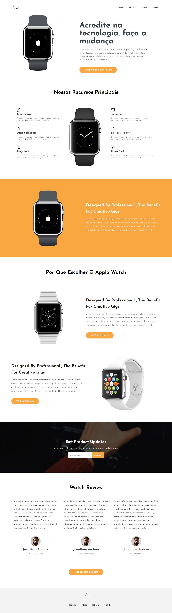

# Landing Page do Apple Watch Fictício - HTML, CSS e JS

Este repositório contém um projeto de uma landing page para um Apple Watch fictício, desenvolvido para fins educativos. Utilizando HTML, CSS e JavaScript, o projeto tem como objetivo simular a apresentação e detalhamento do produto de forma atraente e responsiva.

<a href="https://landing-page-apple-watch.netlify.app">Link</a>

## Descrição

A landing page do Apple Watch fictício é um projeto desenvolvido para praticar habilidades no front-end utilizando HTML, CSS e JavaScript. A página tem como objetivo simular uma página de detalhes de um Apple Watch, fornecendo informações sobre o produto, suas funcionalidades e benefícios.

## Funcionalidades

- Layout responsivo para diferentes dispositivos
- Detalhamento do produto com informações e imagens
- Animações e interações básicas com JavaScript

## Tecnologias Utilizadas

- HTML5
- CSS3
- JavaScript

## Como Usar

1. Clone ou faça o download deste repositório para o seu ambiente local.

2. Abra o arquivo `index.html` em um navegador da web.

3. Explore a landing page para visualizar as informações e detalhes fictícios do Apple Watch.

4. Experimente as animações e interações presentes na página.

## Contribuindo

Este projeto foi desenvolvido com o propósito educativo e, portanto, não são aceitas contribuições externas neste momento.

## Licença

Este projeto é apenas para fins educativos e não possui uma licença específica.

## Contato

Se você tiver alguma dúvida ou sugestão relacionada a esta landing page do Apple Watch fictício em HTML, CSS e JS, sinta-se à vontade para entrar em contato comigo através dos meus dados de contato abaixo:

- Nome: [Seu Nome]
- E-mail: [Seu E-mail]
